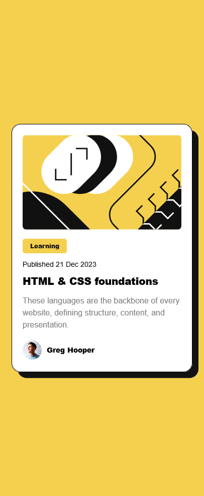

# Frontend Mentor - Blog preview card solution

This is a solution to the [Blog preview card challenge on Frontend Mentor](https://www.frontendmentor.io/challenges/blog-preview-card-ckPaj01IcS). Frontend Mentor challenges help you improve your coding skills by building realistic projects.

## Table of contents

- [Overview](#overview)
  - [The challenge](#the-challenge)
  - [Screenshot](#screenshot)
  - [Links](#links)
- [My process](#my-process)
  - [Built with](#built-with)
  - [What I learned](#what-i-learned)
- [Author](#author)

**Note: Delete this note and update the table of contents based on what sections you keep.**

## Overview

This is my final solution for challenge [Blog preview card](https://www.frontendmentor.io/challenges/blog-preview-card-ckPaj01IcS) in Frontend Mentor

### The challenge

Users should be able to:

- See the right style in all resolutions from 320px to large screens
- See hover and focus states for all interactive elements on the page

### Screenshot




### Links

- Solution URL: [Add solution URL here](https://lmcyber.github.io/blog-preview-card-fm/)
- Live Site URL: [Add live site URL here](https://lmcyber.github.io/blog-preview-card-fm/)

## My process

I started by centering all the content of the body and then styling it. I used grid to center and flex to organize the author’s section.

### Built with

- Semantic HTML5 markup
- CSS custom properties
- Flexbox
- CSS Grid
- Mobile-first workflow

### What I learned

I learned to use Grid to center content from the beginning.

```css
.body {
  display: grid;
  place-content: center;
  height: 100vh;
}
```

## Author

- Website - [Luis Manuel Mendoza Guerrero](https://github.com/LMCyber)
- Frontend Mentor - [@LMCyber](https://www.frontendmentor.io/profile/@LMCyber)
